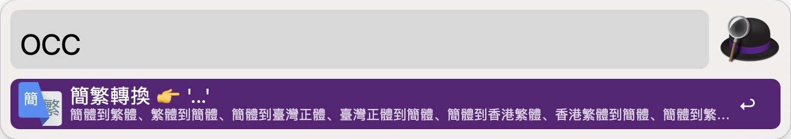
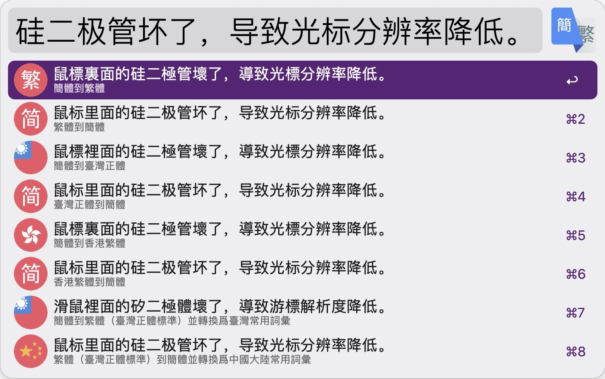

# Open Chinese Convert 開放中文轉換

## Introduction

由於 MacOS 在 12.3 終於移除對 Python2 的支援，導至 Alfred 4 版本中原先使用的 [amowu/alfred-chinese-converter](https://github.com/amowu/alfred-chinese-converter) 已經無法再使，作者也沒有更新。所以透過 Golang 自己造一個也省去了對 Python 的依賴。

## Installation

訪問 [Releases · cage1016/alfred-opencc](https://github.com/cage1016/alfred-opencc/releases) 以獲取最新版本

## Usage

| ENV | Enabled  |   |
|----------------|---|---|
| ENABLED_S2T    | 1  | 簡體到繁體 |
| ENABLED_T2S    | 1  | 繁體到簡體 |
| ENABLED_S2TW   | 1  | 簡體到臺灣正體 |
| ENABLED_TW2S   | 1  | 臺灣正體到簡體 |
| ENABLED_S2HK   | 1  | 簡體到香港繁體 |
| ENABLED_HK2S   | 1  | 香港繁體到簡體 |
| ENABLED_S2TWP  | 1  | 簡體到繁體（臺灣正體標準）並轉換爲臺灣常用詞彙 |
| ENABLED_TW2SP  | 1  | 繁體（臺灣正體標準）到簡體並轉換爲中國大陸常用詞彙 |

使用關鍵字 `occ` 輸入需要作簡繁轉換的詞句

總共支援 8 種轉換模式，可以自行設定啟用或關閉

- 簡體到繁體
- 繁體到簡體
- 簡體到臺灣正體
- 臺灣正體到簡體
- 簡體到香港繁體
- 香港繁體到簡體
- 簡體到繁體（臺灣正體標準）並轉換爲臺灣常用詞彙
- 繁體（臺灣正體標準）到簡體並轉換爲中國大陸常用詞彙

## Contribute
If you find any bug or want to propose a new feature, please open an issue to discuss it.

## Third Party Library

- [longbridgeapp/opencc](https://github.com/longbridgeapp/opencc) Apache License
- [cage1016/opencc: Pure Go version OpenCC 繁簡轉換](https://github.com/cage1016/opencc) Apache License

## License
This repository contains free software released under the MIT Licence. Please check out the [LICENSE](./LICENSE) file for details.